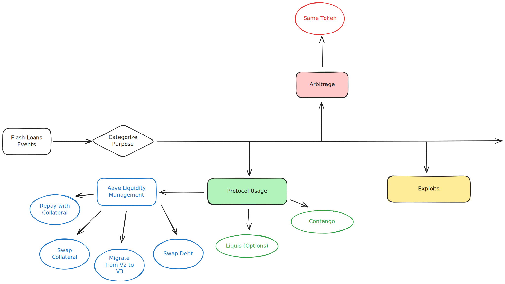

# Flash Loans Exploration

Tracking flash loan activity across various EVM chains.

## Overview

## Data

Flash loan log data is collected from Dune. Currently only **Aave V3** flash loans are collected. To categorize flash loans on their purpose, we examine other interactions that are performed with the flash loan.

For the initial flash loan event collection, seperate Dune queries are created for each blockchain with each listed below: 
* <a href="https://dune.com/queries/3405440">Ethereum Flash Loans</a>
* <a href="https://dune.com/queries/3577310">Polygon Flash Loans</a>

### Schema
Below is the data schema associated with the Dune queries in the initial flash loan event collection step.
<table>
  <tr>
    <th>Columns</th>
    <th>Data Type</th>
    <th>Description</th>
  </tr>
  <tr>
    <td>evt_tx_hash</td>
    <td>hex</td>
    <td>Transaction hash that contained that flash loan event.</td>
  </tr>
  <tr>
    <td>evt_index</td>
    <td>int</td>
    <td>The specific log index in the block that contained the emitted the floan loan event.</td>
  </tr>
    <tr>
    <td>evt_block_time</td>
    <td>datetime</td>
    <td>Time that this was block was mined at.</td>
  </tr>
    <tr>
    <td>amount</td>
    <td>float</td>
    <td>Size of flash loan issed in symbol units</td>
  </tr>
    <tr>
    <td>amount_usd</td>
    <td>float</td>
    <td>Size of flash loan issued in $USD.</td>
  </tr>
    <tr>
    <td>premium</td>
    <td>float</td>
    <td>The flash loan fee to the lending pool in the symbol currency.</td>
  </tr>
    <tr>
    <td>premium_usd</td>
    <td>float</td>
    <td>The flash loan fee in $USD paid to the lending pool.</td>
  </tr>
    <tr>
    <td>gas</td>
    <td>float</td>
    <td>Amount of gas paid to process this transaction in the blockchain's native currency.</td>
  </tr>
    <tr>
    <td>gas_usd</td>
    <td>float</td>
    <td>The gas fee associated with the flash loan in $USD.</td>
  </tr>
 </tr>
    <tr>
    <td>interestRateMode</td>
    <td>int</td>
    <td></td>
  </tr>
 </tr>
    <tr>
    <td>symbol</td>
    <td>string</td>
    <td>The currency that the flash loan was issued in.</td>
  </tr>
 </tr>
    <tr>
    <td>initiator</td>
    <td>hex</td>
    <td>The address that initated that flash loan.</td>
  </tr>
 </tr>
    <tr>
    <td>target</td>
    <td>hex</td>
    <td>The address that received the flash loan funds.</td>
  </tr>
 </tr>
    <tr>
    <td>tx_type</td>
    <td>string</td>
    <td>The flash loan's purpose. </td>
  </tr>
</table>

For flash loans that are categorized as **Arbitrage**, another step is performed:
TODO